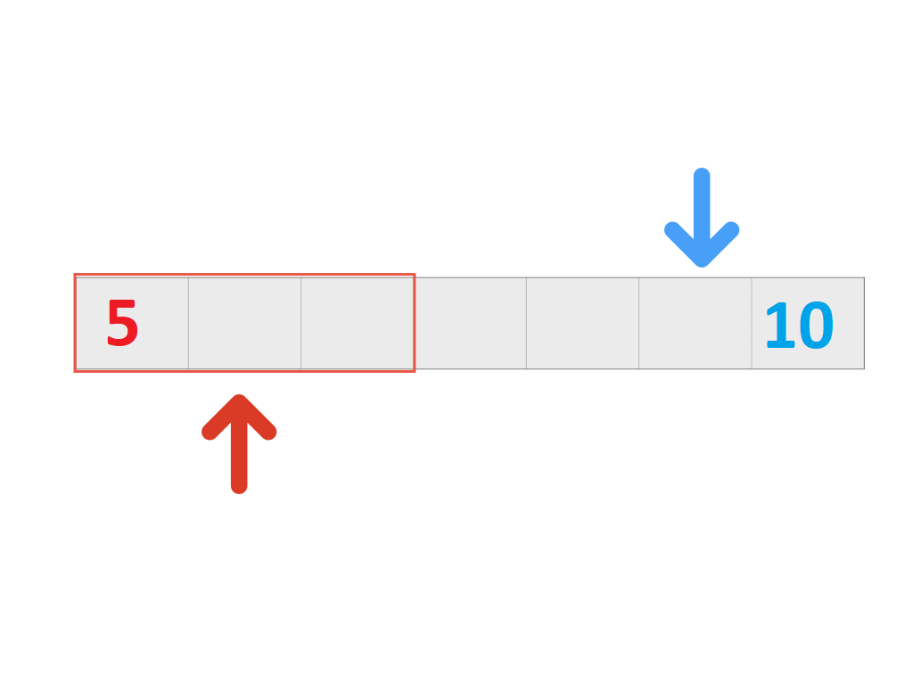

# Deque Implementation in MIPS Assembly and C++



## Overview
This project implements a **Deque (Double-Ended Queue)** using **MIPS Assembly** and **C++**. A deque allows insertion and deletion from both ends, making it more flexible than a standard queue or stack. 

The MIPS assembly version uses **low-level memory management and register operations**, while the C++ version provides an easier-to-understand high-level implementation.

## Features
- **Push to Front** (`push_front`): Add an element to the front.
- **Push to Back** (`push_back`): Add an element to the back.
- **Pop from Front** (`pop_front`): Remove an element from the front.
- **Pop from Back** (`pop_back`): Remove an element from the back.
- **Display** (`display`): Show the current elements of the deque.

## Implementation Details
### **MIPS Assembly Version**
- The **deque** is stored in a memory space of **40 bytes** (assuming `MAX_SIZE = 10` with each element being **4 bytes**).
- The **front index (`frontIdx`)** starts at `-1` and moves forward.
- The **rear index (`rearIdx`)** starts at `10` and moves backward.
- If the deque is full or empty, an appropriate **error message** is printed.
- Display function prints elements from **front to rear**, ensuring correct order.

### **C++ Version**
- Uses a **fixed-size array** (`deque[SIZE]` where `SIZE = 10`).
- `front` and `back` indices **manage** insertions and deletions.
- Similar to the assembly version, it ensures boundary checks and handles **overflow/underflow errors**.

## Usage
### **Running the MIPS Assembly Code**
To run the assembly code, use the **MARS MIPS simulator**:
1. Load the `.asm` file in **MARS**.
2. Assemble the program (`F3` or **Run → Assemble**).
3. Run the program (`F5` or **Run → Go**).

### **Running the C++ Code**
To compile and run the C++ version:
```sh
 g++ deque.cpp -o deque
 ./deque
```

## Example Output
**Case 1: Adding and Removing Elements**
```
> push_front(5)
> push_back(10)
> push_front(3)
> display()
Output: {3, 5, 10}

> pop_back()
> display()
Output: {3, 5}
```

**Case 2: Handling Errors**
```
> pop_front()
> pop_front()
> pop_front()
> pop_front()
Output: Deque is Empty :(
```
